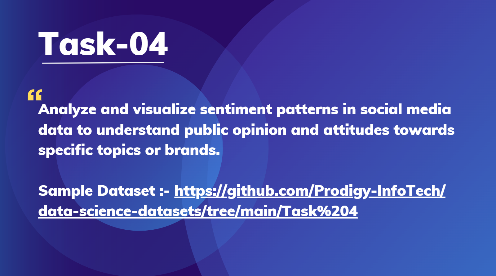

# Prodigy_Infotech_DataScience-Task4
## OVERVIEW
This repository contains the code and documentation for my data science internship project at Prodigy Infotech, focusing on Twitter sentiment analysis. The goal of this project is to analyze sentiment patterns in social media data to gain insights into public opinion and attitudes towards various topics, brands, and events.

## DATASETS
The dataset used for this project consists of Twitter entity sentiment data collected from github.

## METHODOLOGY
- Data Cleaning & Preprocessing: Removed duplicates, stopwords, special characters, and performed tokenization.

- Exploratory Data Analysis (EDA): Analyzed sentiment distribution across different topics and entities.

- Modeling & Visualization: Applied Natural Language Processing (NLP) techniques and created visualizations to represent sentiment trends.

## KEY FINDINGS
- Negative sentiments are more common compared to positive ones.

- Positive and neutral sentiments still make up a large portion of the data.

- Certain topics/brands trigger stronger emotional reactions than others.

- Sentiment distribution varies across time, showing shifts in public opinion.

## CONCLUSION
The sentiment analysis provides valuable insights into public attitudes and opinions within the Twitter community. While negative sentiments dominate, there is still a diverse range of emotions expressed across different topics. These findings are useful for businesses, policymakers, and organizations to monitor brand perception, track public opinion, and make data-driven decisions.

## CONTACT
EMAIL - 11aishwarya00@gmail.com

Thank you for reviewing my internship task submission!
